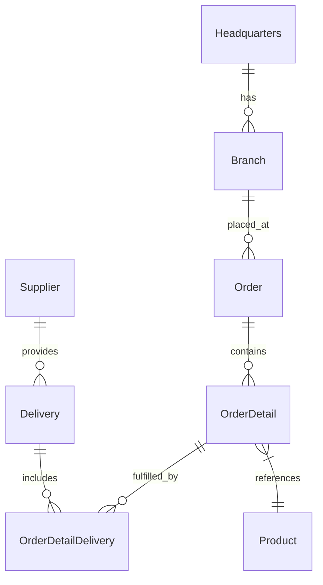

# 🚀 OctoCAT Supply: Smart Cat Tech E-Commerce Platform


Welcome to the OctoCAT Supply Website - a modern e-commerce platform for AI-powered smart cat products, built with Vue.js and FastAPI.

## 🏗️ Architecture

The application is built using modern TypeScript/Python with a clean separation of concerns:



### Tech Stack

- **Frontend**: Vue 3, TypeScript, Tailwind CSS, Vite, Pinia, Vue Router
- **Backend**: FastAPI, Python, SQLite, OpenAPI/Swagger
- **Data**: SQLite (file db at `api/data/app.db`; in-memory for tests)
- **DevOps**: Docker

## 🚀 Getting Started

### Prerequisites

- Python 3.10+ and pip
- Node.js 18+ and npm (for frontend)
- Make

### Quick Start

1. Clone this repository

2. Install dependencies:

   ```bash
   make install
   ```

3. Start the development environment:

   ```bash
   make dev
   ```

This will start both the API server (on port 3000) and the frontend development server (on port 5137).

### Available Make Commands

View all available commands:

```bash
make help
```

Key commands:

- `make dev` - Start both API and frontend development servers
- `make dev-api` - Start only the API server
- `make dev-frontend` - Start only the frontend server
- `make build` - Build both API and frontend for production
- `make db-init` - Initialize database schema
- `make db-seed` - Seed database with sample data
- `make test` - Run all tests
- `make clean` - Clean build artifacts and dependencies

### Database Management

Initialize the database explicitly (migrations + seed):

```bash
make db-init
```

Seed data only:

```bash
make db-seed
```

Or use the API Makefile directly:

```bash
cd api && make db-migrate     # Run migrations only
cd api && make db-seed        # Seed data only
```

### VS Code Integration

You can also use VS Code tasks and launch configurations:

- `Cmd/Ctrl + Shift + P` -> `Run Task` -> `Build All`
- Use the Debug panel to run `Start API & Frontend`

## 🛠️ MCP Server Setup (Optional)

For extended development capabilities:

1. Install Docker/Podman for the GitHub MCP server
2. Use VS Code command palette:
   - `MCP: List servers` -> `playwright` -> `Start server`
   - `MCP: List servers` -> `github` -> `Start server`
3. Configure with a GitHub PAT (required for GitHub MCP server)

## 📚 Documentation

- [Detailed Architecture](./docs/architecture.md)
- [SQLite Integration](./docs/sqlite-integration.md)

Database defaults and env vars:

- DB file: `api/data/app.db` (override with `DB_FILE=/absolute/path/to/file.db`)
- Enable WAL: `DB_ENABLE_WAL=true` (default)
- Foreign keys: `DB_FOREIGN_KEYS=true` (default)

---

| **Feature Name**                                          | **When to Use**                                                                                                                                                           | **Benefit**                                                                                                                       |
| --------------------------------------------------------- | ------------------------------------------------------------------------------------------------------------------------------------------------------------------------- | --------------------------------------------------------------------------------------------------------------------------------- |
| **Agent Mode (Plain/Default)**                            | When you need the Agent to perform a task within your IDE (e.g., adding a test, refactoring) and you provide explicit instructions in the chat.                           | Offers a popular, baseline level of assistance for coding tasks directly within the editor.  Auto-Mode now allows you to avoid    |
| **Custom Instructions & Path-Specific Instruction Files** | To provide additional, persistent context (e.g., coding standards, project structure) to the default Agent Mode for better performance.                                   | Improves the **specificity** and **context awareness** of the default Agent's output.                                             |
| **Tooling via MCP Servers**                               | When a task requires the Agent to interact with services or data outside of the immediate code, such as external APIs or specific GitHub features (e.g., Copilot Spaces). | **Extends the Agent's capabilities** beyond basic code manipulation by giving it access to necessary external resources and data. |
| **Custom Agents (Repository-Designed)**  | When a specific, complex, multi-step workflow is needed (e.g., Test-Driven Development planning, Terraform deployments) that requires a curated toolset and context.   | Allows for highly **specialized, multi-step automation** of domain-specific tasks using agents optimized for that particular workflow.             |
| **Enterprise-Wide Custom Agents**        | When organization administrators need to develop and deploy standardized, company-wide custom agents for shared workflows and governance. *Requires GitHub Enterprise. | **Ensures consistency** and provides secure, **pre-approved tooling** and context for all developers within the enterprise.                        |
| **Copilot Coding Agent (Agent Session)** | For complex, time-consuming tasks (e.g., generating all unit tests for a feature) that can be run **asynchronously** in the cloud, independent of your IDE session.    | Frees up the developer's local environment, allowing them to **monitor and review large, complex changes** via Mission Control and a Pull Request. |
| **Mission Control (GitHub.com)** | To view an Agent Session in real-time, intervene with **mid-session steering**, and review a completed agent's run status, including CodeQL checks. | Provides a **centralized, transparent hub** for tracking, managing, and intervening in asynchronous agent tasks.                                     |
| **Coding Review Agent**          | When a Pull Request is ready for review, especially when a branch ruleset requires a review based on the **entire codebase** for maximum context.   | **Automates and enhances code review** by applying the context of the _entire codebase_ and relevant enterprise instructions to find complex issues. |
| **Copilot Immersive Experience - Chat**   | To quickly ask questions or summarize complex information (like Code Review findings) directly from a GitHub Pull Request with the relevant context already loaded. | Enables **fast, context-aware information retrieval and synthesis** directly related to the current development artifact (the PR).          |
| **Copilot Immersive Experience - Spaces** | To create a **persistent, curated context window** by adding files, directories, issues, and text from across GitHub and referencing it in both chat and the IDE.   | Acts as a **memory layer** for Copilot, ensuring complex, spread-out context is always available for Agents and Chat, maximizing relevance. |
| **Copilot CLI** |	When you want to use natural language for complex Shell or delegation tasks. |	Brings the agent's intelligence to your terminal for command execution and asynchronous task launch. |


*Built with Vue.js, FastAPI, and GitHub Copilot* 🤖✨
