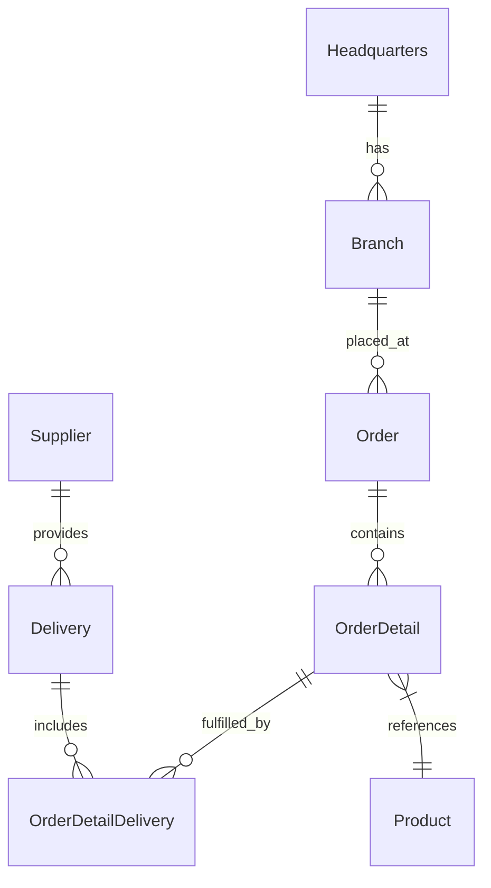
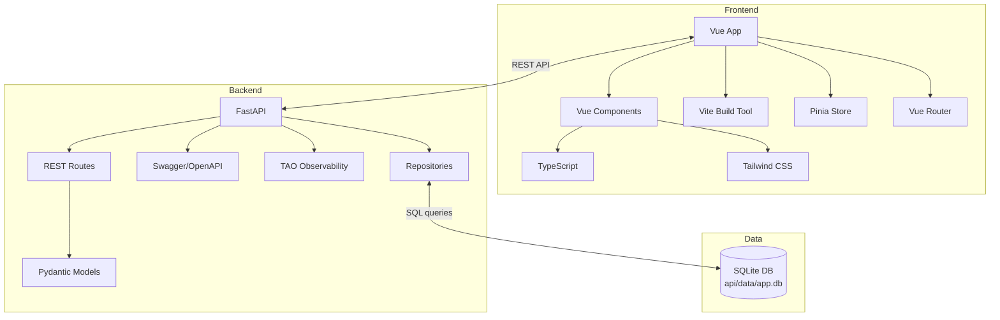

# OctoCAT Supply Chain Management System Architecture

This is a full-stack e-commerce application with a Python backend and TypeScript frontend. The entire app was created originally from an [ERD diagram](../api/ERD.png) and natural language prompts using Copilot. The frontend was created in the same way, using some of the design ideas in [the design folder](./design/).

The hero image and product images were created by prompting ChatGPT!

## Architecture Overview

The system is a modern supply chain management application with a Python backend and TypeScript frontend, comprising a REST API and a Vue.js frontend. It follows typical enterprise architecture patterns with clean separation of concerns.

### Backend Architecture
- FastAPI with RESTful endpoints for all entities
- SQLite persistence using a lightweight repository pattern
- Schema migrations and seed data managed via SQL files
- Swagger/OpenAPI documentation integration
- Pydantic models with proper relationships following an ERD diagram

### Frontend Architecture
- Vue 3 with Composition API and TypeScript
- Vite build tool for fast development
- Pinia for state management
- Vue Router for client-side routing
- TanStack Vue Query for server state management
- Tailwind CSS for UI styling

### DevOps Integration
- Docker/Docker Compose for containerization
- Optional Bicep + GitHub Actions plan for Azure deployment

## ERD

## Component Architecture

## Key Features

- Complete REST APIs for all supply chain entities
- SQLite-backed persistence with foreign keys and indexed queries
- Declarative migrations (docs/sql/migrations) and deterministic seed data
- Detailed OpenAPI documentation
- Modern Vue.js UI with responsive design
- Containerization for consistent deployment

## Persistence and Data Model

- Database: SQLite (file located at `api/data/app.db` by default; configurable via `DB_FILE`)
- Access: thin repository layer with snake_case naming throughout (Pydantic models and SQL columns)
- Migrations: SQL scripts in `api/database/migrations` executed in order and tracked in a `migrations` table
- Seeding: ordered SQL scripts in `api/database/seed` to bootstrap data
- Test mode: in-memory database (`:memory:`) for fast and isolated tests

See the dedicated guide: `docs/sqlite-integration.md`.
